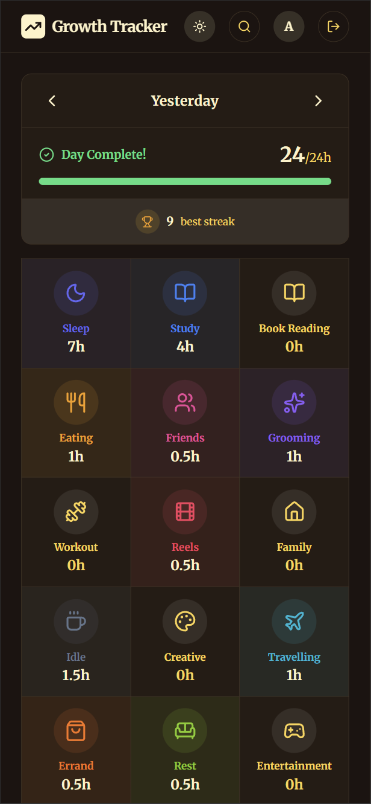
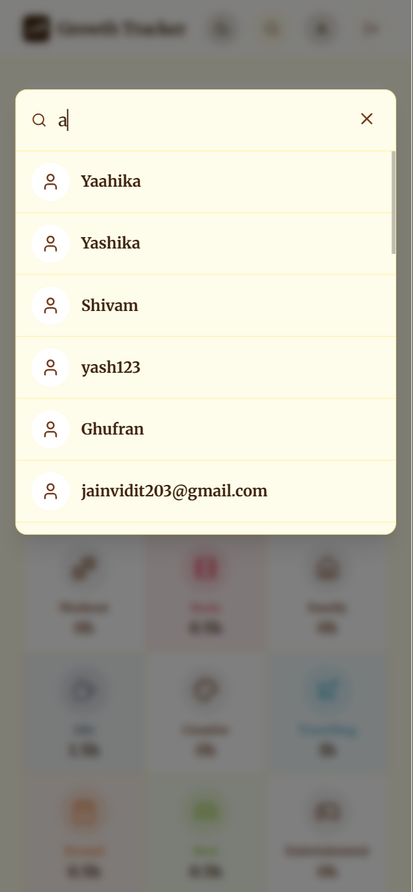
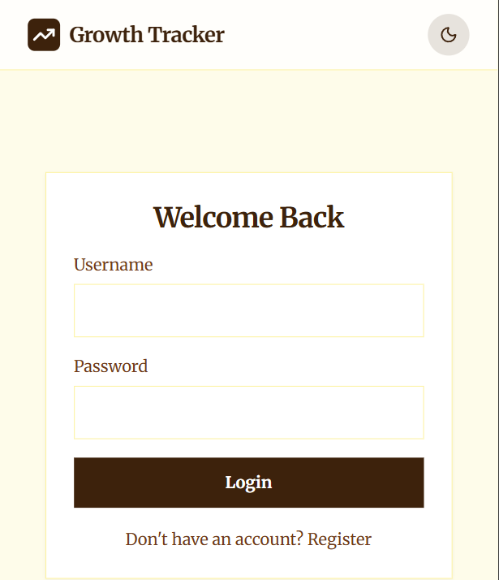
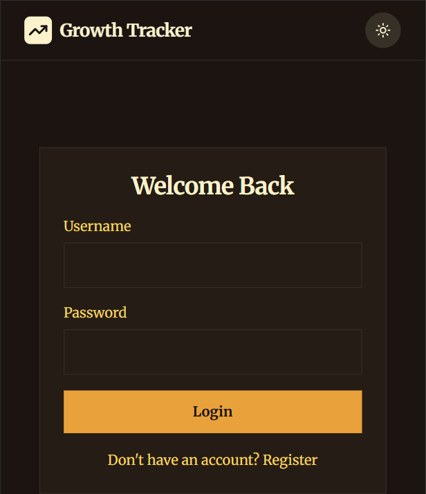

# Growth Tracker 🌱

**Track every hour of your day. Build better habits. Grow intentionally.**

Growth Tracker is a personal productivity app that helps you account for all 24 hours of your day. By tracking how you spend your time across different life activities, you gain insights into your daily patterns and build consistency through streaks.

---

## What is Growth Tracker?

We all have the same 24 hours, but few of us know where they actually go. Growth Tracker solves this by letting you log your time across meaningful categories — sleep, study, work, family, fitness, and more.

The goal is simple: **complete your day by logging all 24 hours**. Do it consistently, and watch your streak grow!

---

## Screenshots

### 📱 Dashboard - Dark & Light Mode

  
  &nbsp;&nbsp;&nbsp;
  

The dashboard shows your daily progress at a glance:
- **Date Navigator** — Browse through your past days
- **Progress Bar** — See how many hours you've logged out of 24
- **Streak Counter** — Your best streak for motivation
- **Activity Grid** — Colorful tiles for each life category with logged hours

### 🔍 User Search

  

Find and connect with other users to view their tracked days and get inspired by how others spend their time.

### 🔐 Authentication - Light & Dark

  
  &nbsp;&nbsp;&nbsp;
  

Clean, minimal login and registration screens with support for both light and dark themes.

---

## Activity Categories

Track time across **16 life categories**:

| Category | Category | Category | Category |
|----------|----------|----------|----------|
| 😴 Sleep | 📚 Study | 📖 Book Reading | 🍽️ Eating |
| 👥 Friends | 💆 Grooming | 🏋️ Workout | 📱 Reels |
| 🏠 Family | ☕ Idle | 🎨 Creative | ✈️ Travelling |
| 🛒 Errand | 🛋️ Rest | 🎮 Entertainment | 💼 Office |

---

## Features

✨ **24-Hour Day Tracking** — Log activities until your day is complete  
🔥 **Streak System** — Build consistency with daily streaks  
🌗 **Dark & Light Mode** — Beautiful warm theme in both modes  
📅 **Historical View** — Browse and edit past days  
👥 **Social Features** — Search and view other users' progress  
📱 **Cross-Platform** — Web app + Native Android app  

---

## TODOs

- [ ] Add weekly and monthly analytics dashboard
- [ ] Add activity reminders / notifications
- [ ] Social features - follow users, leaderboards
- [ ] Export data to CSV/PDF
- [ ] Activity suggestions based on patterns
- [ ] Goal setting per activity category
- [x] Notes for each activity
- [x] Make profile private/public option
- [x] Reset password functionality
- [ ] Custom activity tiles
- [x] Dark Theme
- [x] Reset Password/Username
- [ ] Friends
- [x] Username validation to have small char / numbers / _ / .
- [ ] Unit test cases
- [x] Profile Photo

